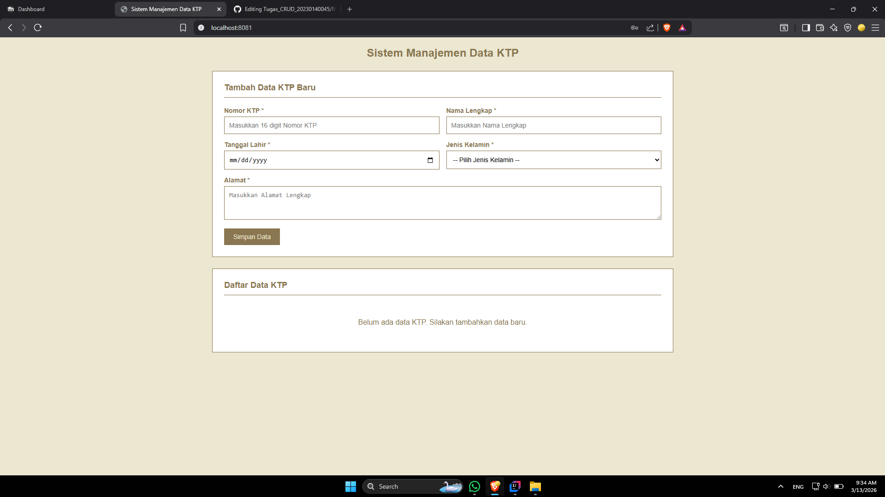
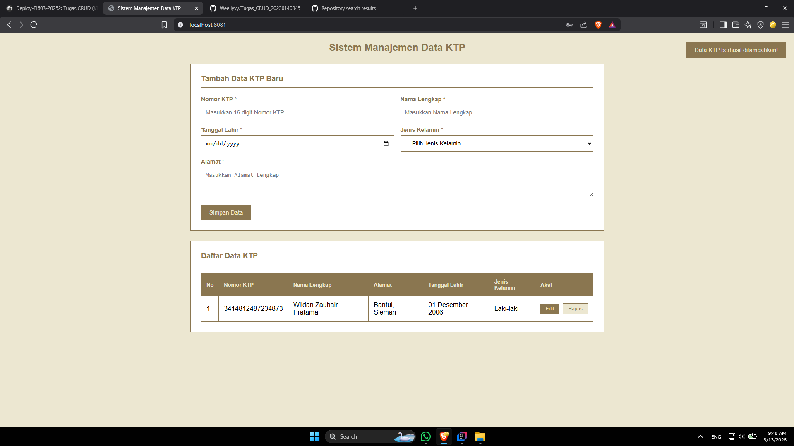
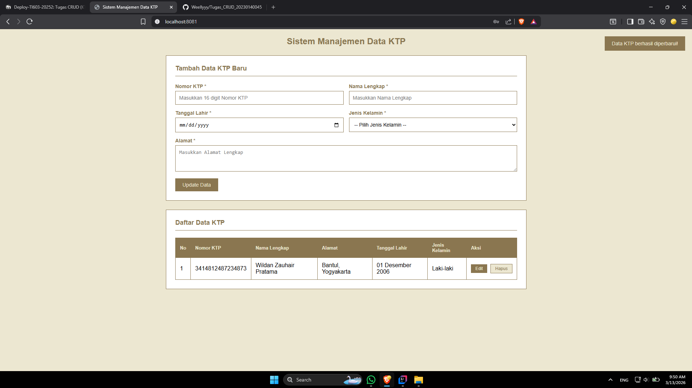
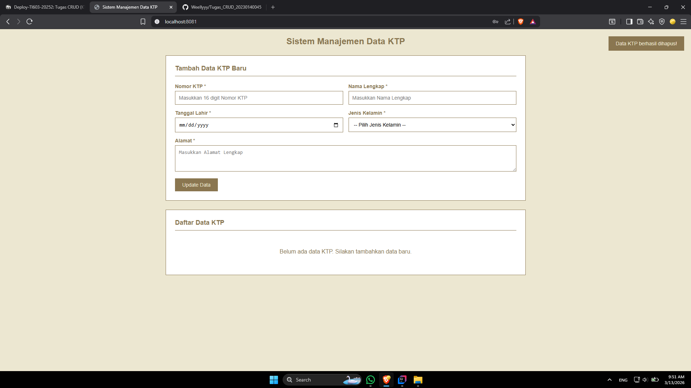
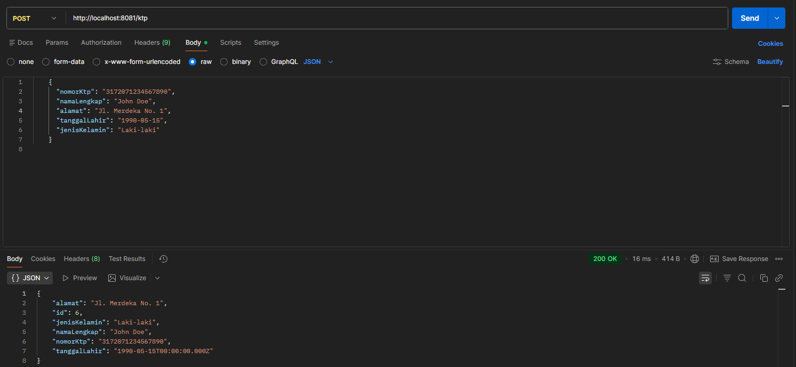
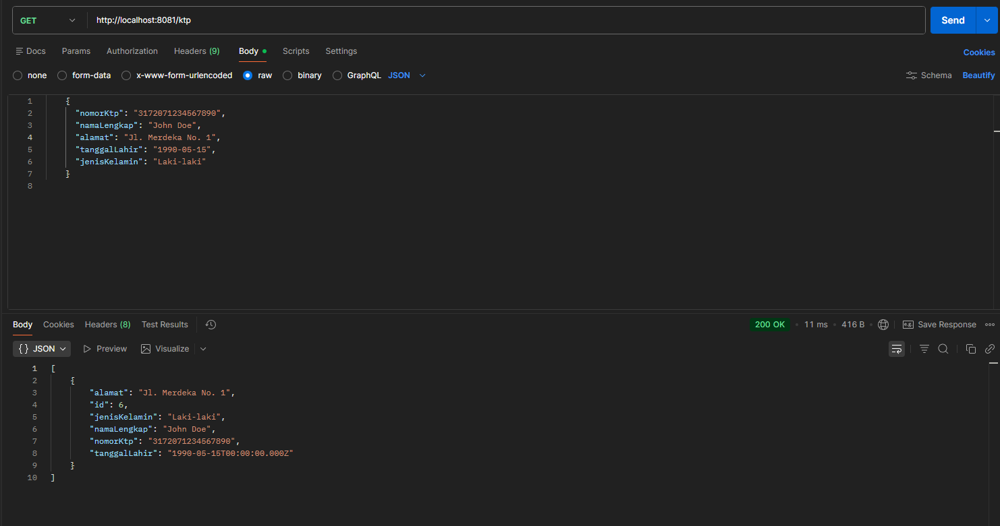
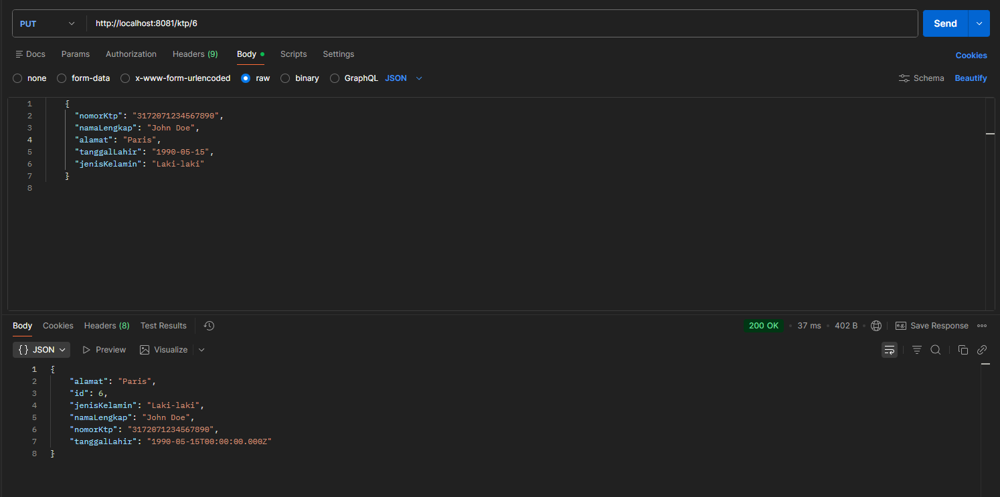
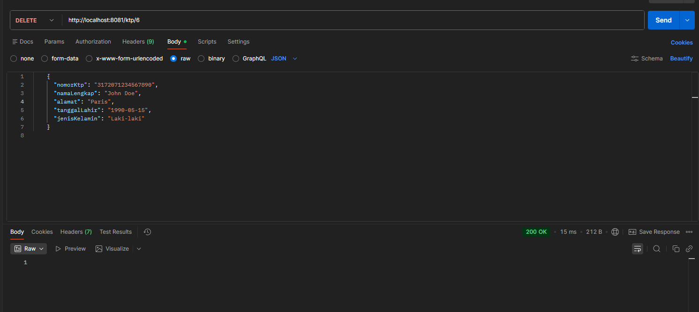
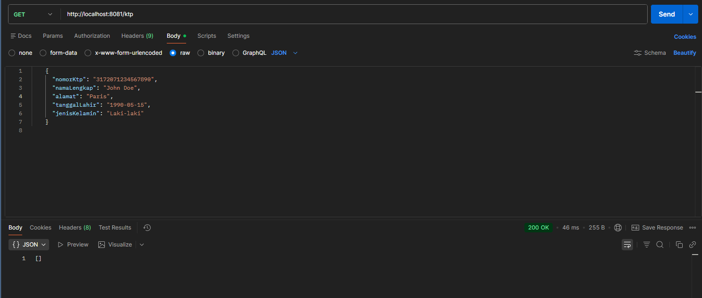
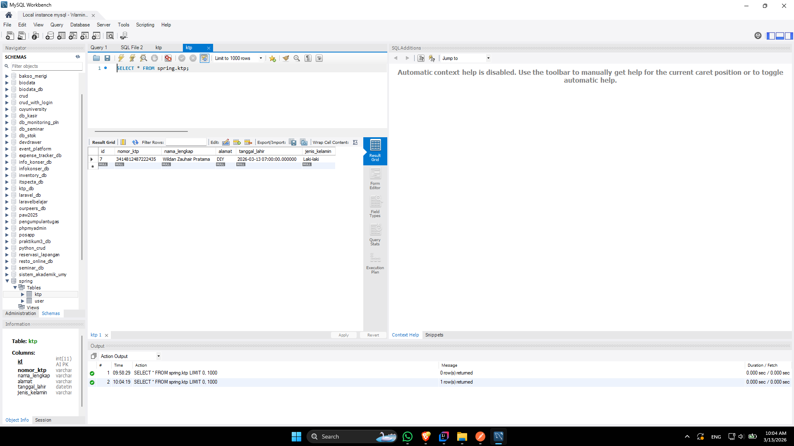

TAMPILAN AWAL WEBSITE : 
SETELAH TERISI DATA : 
EDIT DATA : 
HAPUS DATA : 

DOKUMENTASI API

POST : /ktp

GET : /ktp

PUT : /ktp/{id}

DELETE : /ktp/{id}

GET SETELAH HAPUS DATA : /ktp/ 

DATABASE
